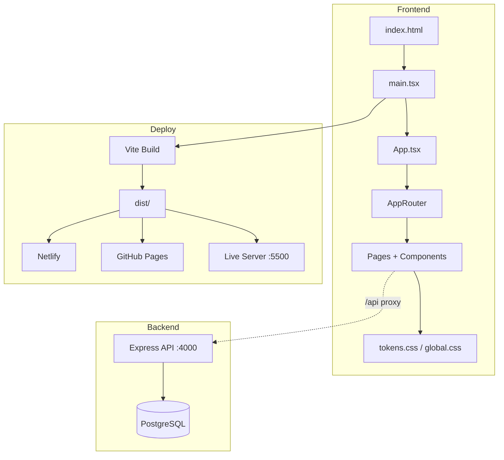

# Mapeamento do Ecossistema — BetShow

**Data:** 07 de agosto de 2026  
**Escopo:** Pasta raiz do projeto + diretórios externos relacionados

---

## 1. Visão geral do ecossistema

```
J:\area de trabalho\Fron_End\Projetos\
│
├── Projeto-Betshow/          ← PROJETO ATUAL (monorepo frontend + backend)
│   ├── src/                  ← React 19 SPA
│   ├── backend/              ← API Node.js (porta 4000)
│   ├── public/               ← Assets estáticos
│   ├── docs/                 ← Documentação profissional
│   ├── scripts/              ← Automação local
│   ├── dist/                 ← Build (gerado por vite build)
│   └── .github/workflows/    ← CI/CD
│
└── [57 outros projetos]      ← Portfólio Front-End (ver seção 3)
```

---

## 2. Inventário interno — `Projeto-Betshow/`

### 2.1 Raiz (arquivos de configuração)

| Arquivo | Função | Manter na raiz? |
|---------|--------|-----------------|
| `index.html` | Entry point HTML | ✅ Sim |
| `package.json` | Dependências e scripts npm | ✅ Sim |
| `package-lock.json` | Lock de versões | ✅ Sim |
| `vite.config.ts` | Build, proxy `/api`, deploy | ✅ Sim |
| `tsconfig.json` | TypeScript raiz | ✅ Sim |
| `tsconfig.app.json` | TypeScript app | ✅ Sim |
| `docker-compose.yml` | Orquestração backend + DB | ✅ Sim |
| `netlify.toml` | Deploy Netlify | ✅ Sim |
| `.env` / `.env.example` | Variáveis de ambiente | ✅ Sim (`.env` no .gitignore) |
| `.gitignore` | Exclusões Git | ✅ Sim |
| `README.md` | Porta de entrada do repositório | ✅ Sim |

### 2.2 Pastas principais

| Pasta | Conteúdo | Arquivos (aprox.) |
|-------|----------|-------------------|
| `src/` | Código-fonte React | ~80 arquivos |
| `src/components/` | 20+ componentes UI | TSX + CSS pareados |
| `src/pages/` | 6 páginas + legal | Home, Auth, Dashboard, Payment |
| `src/styles/` | Design system | tokens, global, forms, dashboard |
| `src/contexts/` | Estado global | AuthContext |
| `src/routes/` | Roteamento | AppRouter (9 rotas) |
| `src/types/` | Tipos TS | user, bet, payment |
| `src/utils/` | Helpers | validators, formatters |
| `src/data/` | Mocks e brand | brand.ts, ambassadors, avatars |
| `src/services/` | API clients | api, betting, markets |
| `public/` | Estáticos | favicon.svg, logo-betshow.svg |
| `backend/` | API REST | Express, PostgreSQL, JWT |
| `scripts/` | Automação | start-public.ps1, start-remote.ps1 |
| `docs/` | Documentação | 6 categorias numeradas |
| `dist/` | Build produção | Gerado — não versionar |
| `node_modules/` | Dependências | Gerado — não versionar |
| `.vscode/` | Config IDE | tasks, settings, extensions |
| `.github/` | CI/CD | deploy-netlify, deploy-github-pages |

### 2.3 Rotas da aplicação

| Rota | Página | Auth |
|------|--------|------|
| `/` | HomePage | Pública |
| `/login` | LoginPage | Pública |
| `/cadastro` | RegisterPage | Pública |
| `/pagamento` | PaymentPage | Autenticado |
| `/privacidade` | PrivacyPolicyPage | Pública |
| `/cookies` | CookiesPolicyPage | Pública |
| `/dashboard` | UserDashboardPage | User |
| `/dashboard/apostas` | UserDashboardPage | User |
| `/admin` | AdminDashboardPage | Admin |
| `/admin/apostas` | AdminDashboardPage | Admin |
| `/admin/usuarios` | AdminDashboardPage | Admin |

### 2.4 Deploy e infraestrutura

| Serviço | URL | Trigger |
|---------|-----|---------|
| Netlify | https://betshow.netlify.app | Push + workflow |
| GitHub Pages | https://jorgeramalho.github.io/Betshow/ | Push `main` |
| Backend local | http://localhost:4000 | `npm run backend:dev` |
| Docker | localhost:4000 + PostgreSQL | `npm run docker:up` |

---

## 3. Projetos externos (pasta `Projetos/`)

O BetShow faz parte de um portfólio com **58 projetos** no diretório pai. Projetos com possível sinergia temática:

| Projeto | Relação com BetShow |
|---------|---------------------|
| `Projeto-ThaylaSports` | Esportes — referência de UI |
| `Projeto-SportCenter` | Esportes — layout |
| `Projeto-VivaPay` | Pagamentos — integração futura |
| `Projeto-SuperBank` | Financeiro — UX de saldo |
| `Projeto-Gamebook` | Gamificação — odds/bets |
| `MyHype` / `Projeto-MyHype` | Possível duplicata — verificar |

**Recomendação:** Manter BetShow isolado como monorepo. Reutilizar padrões de `docs/` e `vite.config.ts` como template para novos projetos do portfólio.

---

## 4. Dependências entre sistemas



---

## 5. Duplicatas e inconsistências identificadas

| Item | Status | Ação tomada |
|------|--------|-------------|
| `ESTRUTURA-ARQUIVOS.md` em raiz e `docs/` | Duplicata | Consolidado em `docs/03-arquitetura/` |
| 8 MDs soltos na raiz | Desorganizado | Movidos para `docs/0X-*/` |
| `README.md` desatualizado | Formatação irregular | Atualizado com índice |
| `MyHype` + `Projeto-MyHype` | Possível duplicata externa | Documentado para revisão manual |

---

## 6. Convenção de nomenclatura adotada

```
docs/
  NN-categoria/     ← NN = ordem de leitura (00–06)
  NOME-EM-MAIUSCULAS.md
  auditoria/
    AUDITORIA-COMPLETA-AAAA-MM-DD.md
    screenshots/
```

**Código-fonte:** PascalCase para componentes (`Header.tsx`), kebab-case para CSS (`Header.css`), camelCase para utils.

---

**© 2026 BetShow — Mapeamento de ecossistema**
